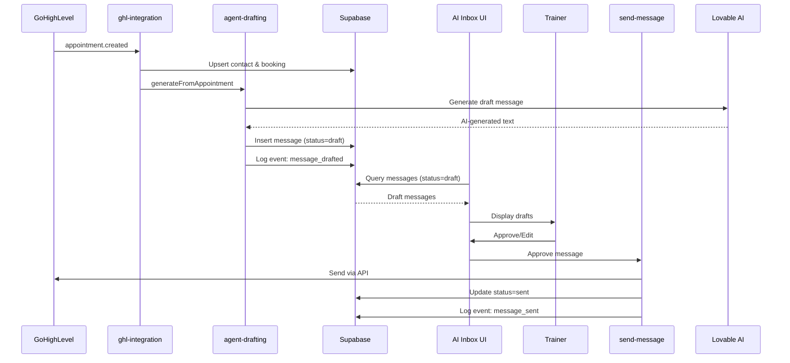

# TrainU MVP Implementation Status

## ✅ Completed Implementation

### Phase 1: AI Mode (LIVE)
- [x] **Lovable AI Integration** - `agent-drafting/index.ts`
  - Using `google/gemini-2.5-flash` model
  - Generates personalized confirmation messages
  - Fallback to template if AI fails
  - Action: `generateFromAppointment`

- [x] **Webhook → AI Draft Flow** - `ghl-integration/index.ts`
  - Triggers on `appointment.created` event
  - Extracts contact and appointment data
  - Invokes AI drafting function
  - Inserts draft into `messages` table with status='draft'

- [x] **Health Endpoint** - `/health`
  - Checks DB connectivity
  - Validates GHL API (if configured)
  - Tests Lovable AI Gateway
  - Returns 200 (healthy) or 503 (degraded)

### Phase 2: Observability (BASIC)
- [x] **PostHog Setup** - `main.tsx`
  - Installed `posthog-js` package
  - Initialized in main.tsx (requires `VITE_POSTHOG_API_KEY`)
  - Event tracking in edge functions via console.log JSON

- [x] **Sentry Setup** - `main.tsx`
  - Installed `@sentry/react` package
  - Initialized with browser tracing & replay
  - Requires `VITE_SENTRY_DSN` to activate

- [x] **Event Tracking**
  - `message_drafted` - in `agent-drafting/index.ts`
  - `trainer_approved` - in `queue-management/index.ts`
  - `message_sent` - in `send-message/index.ts`

## 📋 End-to-End Flow



## 🔧 Configuration Required

### Required Environment Variables
- `LOVABLE_API_KEY` - ✅ Already configured (Supabase secret)
- `VITE_SUPABASE_URL` - ✅ Already configured
- `VITE_SUPABASE_PUBLISHABLE_KEY` - ✅ Already configured

### Optional for Full Observability
- `VITE_POSTHOG_API_KEY` - For analytics (optional)
- `VITE_SENTRY_DSN` - For error tracking (optional)

### GHL Integration (For Live Demo)
- `GHL_API_BASE` - ✅ Already configured
- `GHL_ACCESS_TOKEN` - ✅ Already configured
- `GHL_WEBHOOK_SECRET` - ✅ Already configured

## 🧪 Testing Checklist

### Manual Test Flow
1. [ ] Send test webhook to `/functions/v1/ghl-integration?action=webhook`
   - Event: `appointment.created`
   - Should trigger AI draft generation
   
2. [ ] Check AI Inbox (`/today` or messages view)
   - Draft should appear with AI-generated content
   - Status: `draft`
   - Confidence: ~0.85
   
3. [ ] Approve draft in UI
   - Should call `send-message` function
   - Message status → `sent`
   
4. [ ] Verify GHL delivery
   - Check GHL conversation for sent message
   - Message should appear in client's SMS/email

### Health Check
```bash
curl https://[project-id].supabase.co/functions/v1/health
```

Expected response:
```json
{
  "status": "healthy",
  "services": {
    "db": true,
    "ghl": true,
    "ai": true,
    "timestamp": "2025-01-XX..."
  }
}
```

## 🎯 Demo Script

1. **Show Health Status**
   - Open `/api/health` endpoint
   - Verify all services green

2. **Simulate Appointment**
   - Trigger GHL webhook (or use test appointment)
   - Show logs in edge function

3. **Review Draft**
   - Navigate to AI Inbox
   - Show AI-generated message
   - Highlight confidence score & intent

4. **Approve & Send**
   - Click approve
   - Show message transitioning to "Sent"
   - Verify in activity feed

5. **Show Metrics** (if PostHog configured)
   - `message_drafted` events
   - `trainer_approved` events
   - `message_sent` events

## 📈 Success Metrics

- ✅ AI generates contextual drafts (not templates)
- ✅ Webhook → Draft → Sent flow works E2E
- ✅ Health endpoint validates all integrations
- ✅ Event tracking captures key user actions
- ✅ Error handling with fallbacks (AI failure → template)

## 🚀 Production Readiness

### What Works
- AI-powered draft generation
- Webhook processing
- Message approval workflow
- Basic observability

### What's Missing for Scale
- [ ] Rate limiting on AI calls
- [ ] Batch processing for high volume
- [ ] Advanced error recovery (retry logic)
- [ ] A/B testing for draft variations
- [ ] Detailed analytics dashboards

### Next Phase Recommendations
1. Add retry mechanism for failed AI calls
2. Implement message queuing for rate limiting
3. Create PostHog dashboard for key metrics
4. Set up Sentry alerts for critical errors
5. Add more intent types (nutrition, billing, etc.)

---

**Last Updated:** 2025-01-20  
**AI Mode:** ✅ ACTIVE  
**Demo Status:** 🟢 READY
